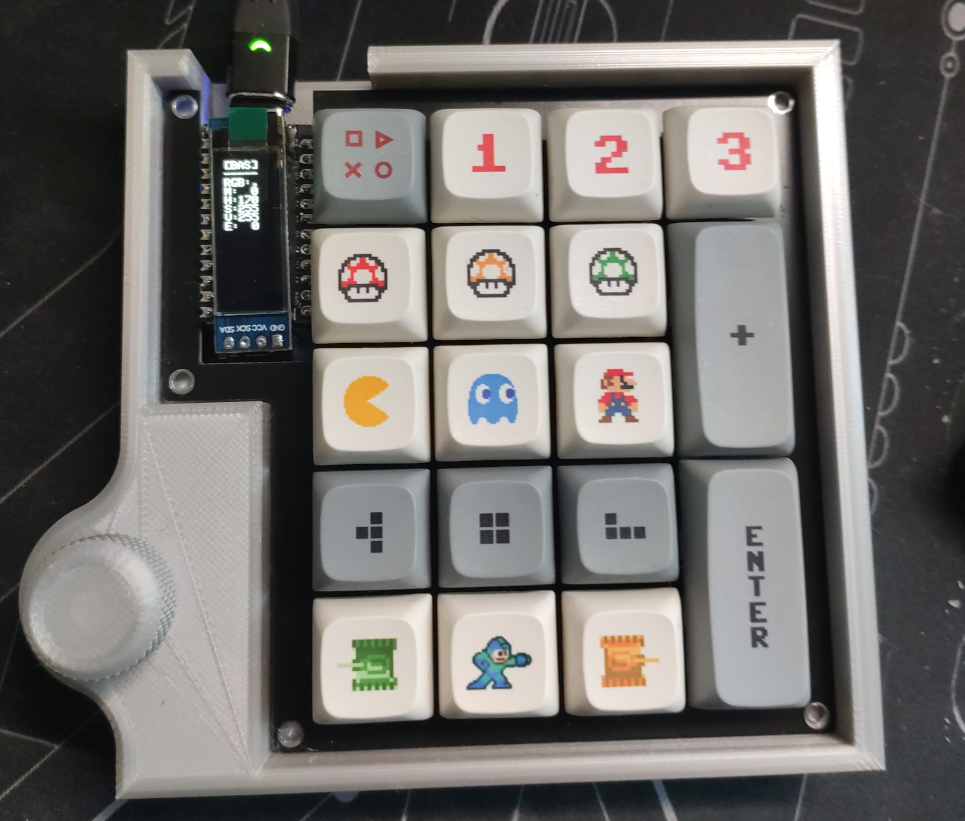
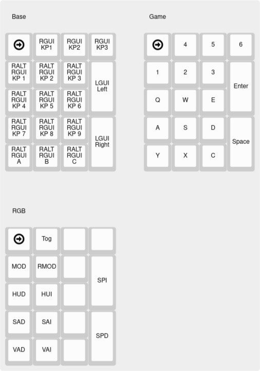

# YamPAD 2.0

A [Yampad](https://github.com/mattdibi/yampad) Macro Keyboard, made by [mattdibi](https://github.com/mattdibi)

All this code is based on mattdibis original code. On my to do list is the integration into the original directory structure.

# Components

- PCBs: Kit from mechboards.co.uk
- CPU: Elite C
- Keys: Gateron Red
- Keycaps: Some XDA caps from aliexpress
- OS: QMK
- Additional encoder hardwired to the additional pins of the Elite C
- Case: 3D printed

# Build and flash

    make yampad2:default:flash

# TODO

- Graphics on OLED

# Layout

Base Layer:

- Workspaces 1..3
- Next / prev virtual desktop
- Window placing hotkeys

Game Layer:

- WASD and neighbors

RGB Layer:

- Setting mode
- Inc / dec hue, saturation, value, speed

[Layout](http://www.keyboard-layout-editor.com/#/gists/dabc14c341cc6295318cdff5066702d0)
